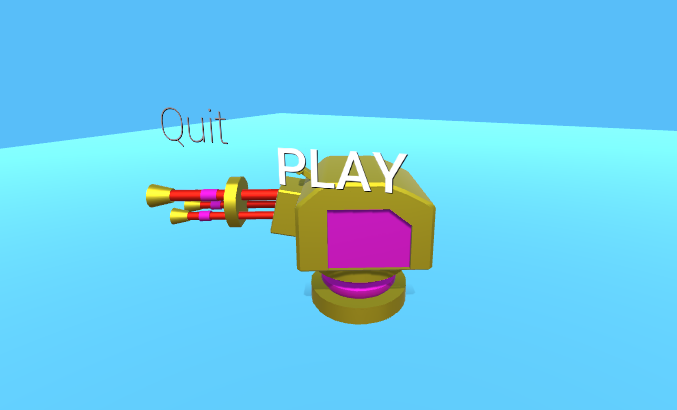

# TowerDefenseProject
Tower Defense example i did when i was doing my internship

Unity Version : 2018.1.7f1

To open the project open this path "...\TowerDefenseProject-master\Tower Defense\Assets\Scenes"  then just click any .unity extension.

//TODO

Level Designs

Skill Tree

Sound

Google Play Achievement

Refactoring

